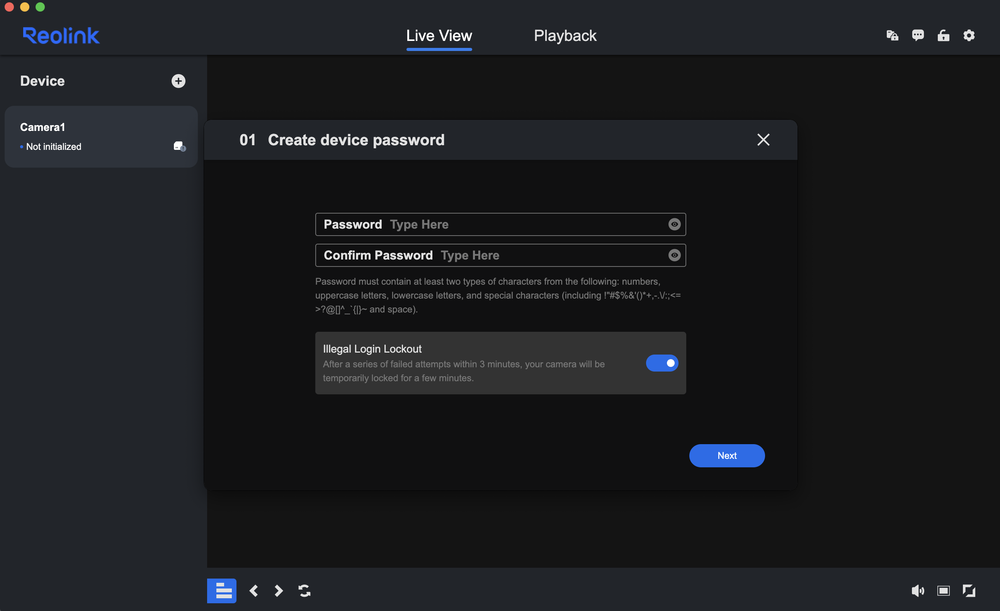
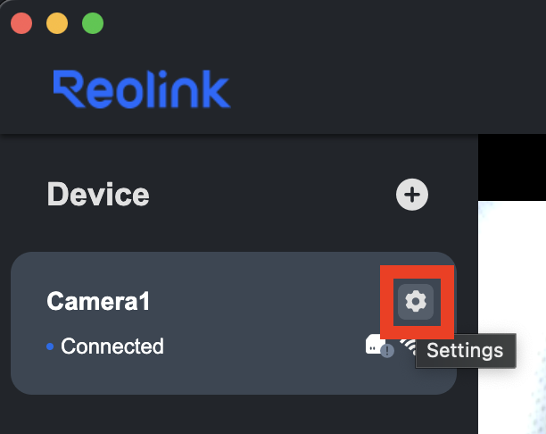
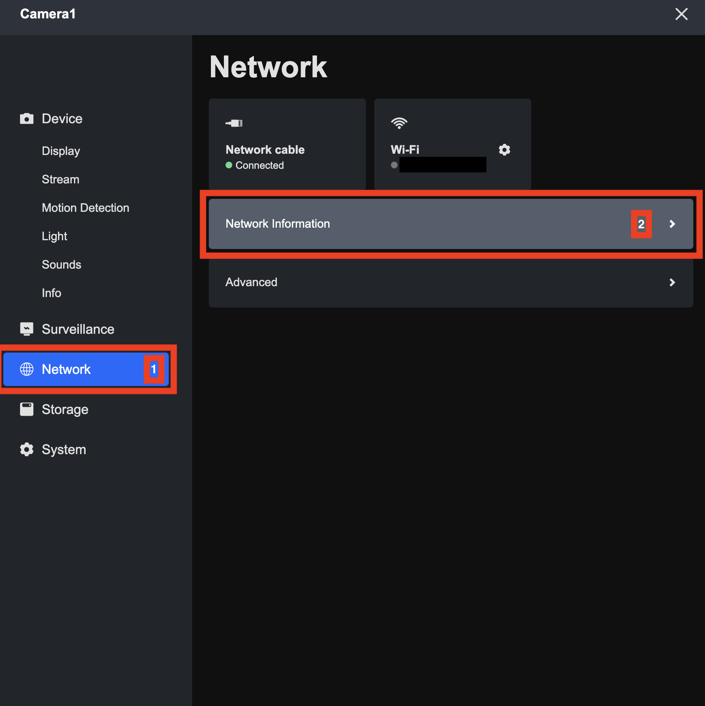
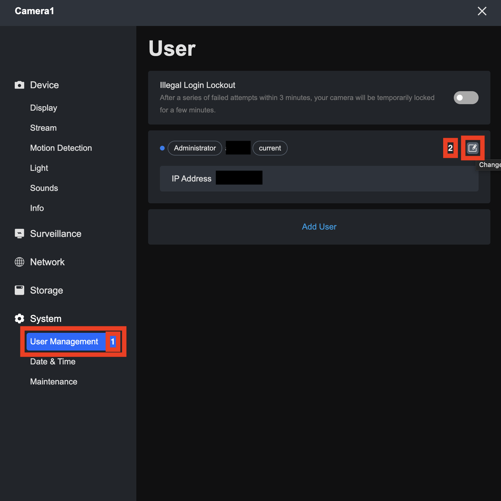
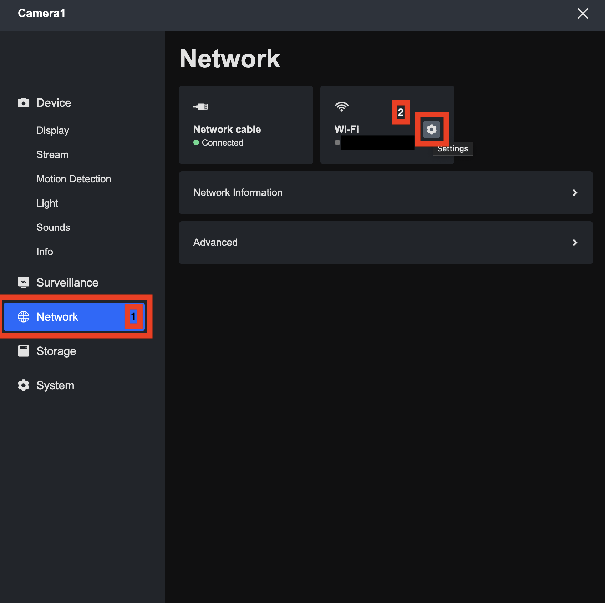
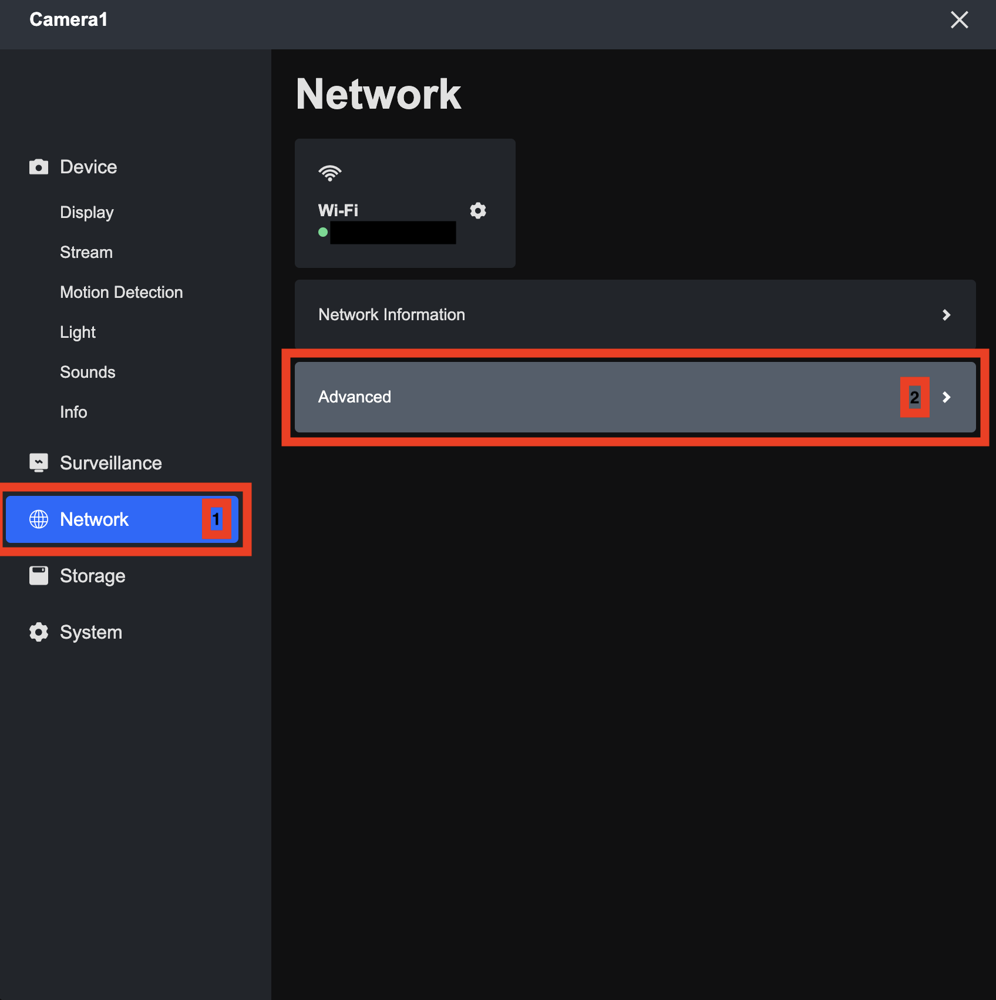
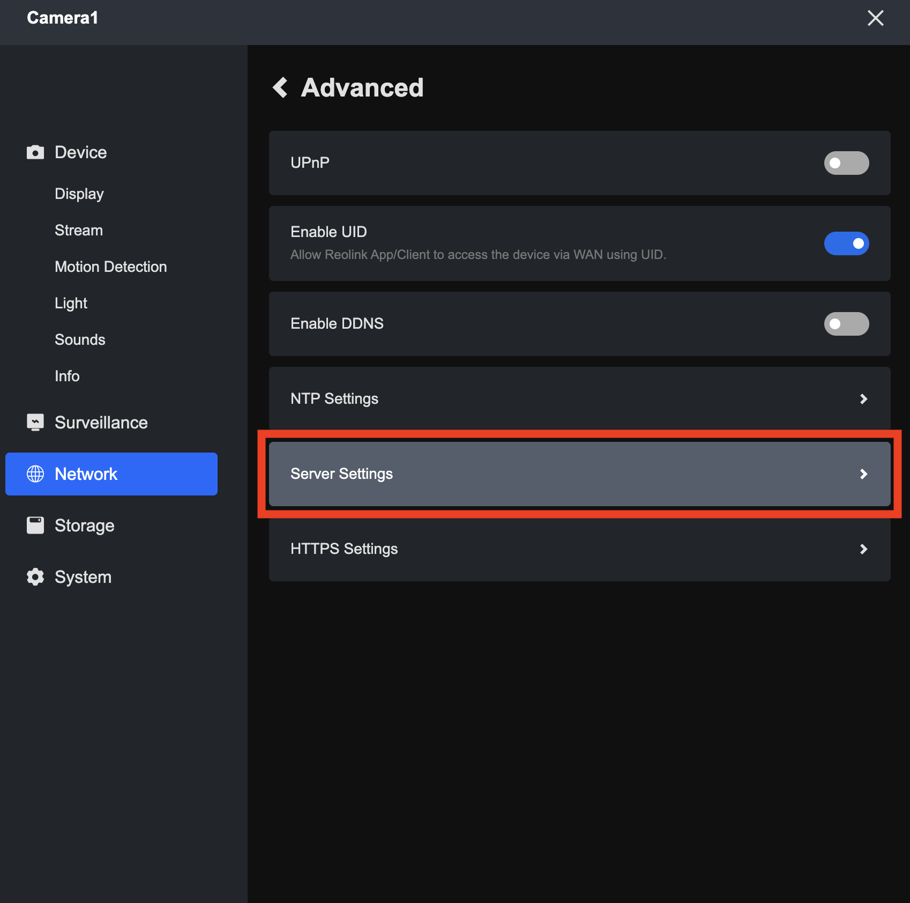
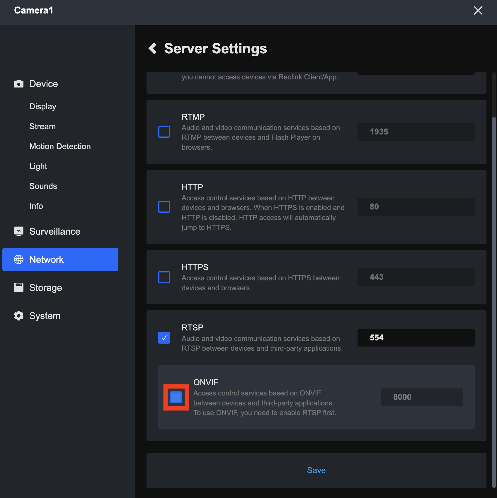

# Setting up the Camera
## Table of Contents
- [What's in the Box](#whats-in-the-box)
- [What You Need](#what-you-need)
- [Connecting Camera to Router Network](#connecting-camera-to-router-network)
- [Checking Camera IP Address](#checking-camera-ip-address)
- [Checking Camera Username + Resetting Password](#checking-camera-username--resetting-password)
- [Changing Camera Network](#changing-camera-network)
- [Enabling RTSP Streaming](#enabling-rtsp-streaming)

## What's in the Box
The camera being used for this project is the [Reolink RLC-840WA](https://reolink.com/au/product/rlc-840wa/).

In the box, there should be (see below image):
- 1x Camera
- 1x Ethernet Cable.
- 1x Power Extension Cable.
- 2x Camera Antennae.
- 1x Pack of Screws.
- 1x Power Adapter.
- 1x Mounting Template.
- 1x Quick Start Guide.

## What You Need
For the camera setup, you need to have the following items:
- 1x Router that has been setup (see [Router Setup Guide](setup-router.md)).
- 1x Device (e.g. Laptop) that has been connected to the router wireless network.
    - You will need to download and install the Reolink Client [here](https://reolink.com/au/software-and-manual/).
- 1x Camera (comes in the box). Model: RLC-840WA.
- 1x Power Adapter (comes in the box). Model: DCT12W120100AU-B0.
- (OPTIONAL) 1x Power Extension Cable (comes in the box).
- 1x Ethernet Cable (comes in the box).

## Connecting Camera to Router Network
1. Screw the antennae into the sides of the camera.
2. Following the connection diagram on page 5 of the camera quick start guide (see below image), plug the power adapter into the camera power cord, and connect the camera to the router via ethernet.

3. Connect your device to the router network, and open the Reolink Client App.
4. Select the camera connected to the network, and setup it's password (see below image).

5. Set the name of the camera (e.g. `Camera1`).
6. Select the router wireless network to connect the camera to. Make sure that whatever network your device is connected to, the camera is connected to the same one (i.e. both on 5GHz, or both on 2.4GHz).

> [!TIP]
> If security is not required, use the name of the camera with an exclamation mark added to the end (e.g. if the camera name is `Camera1`, make the password `Camera1!`).

## Checking Camera IP Address
The IP address of the camera can be found by opening the Reolink Client App and completing the following steps:
1. Open the Settings for the Camera.

2. Go to the Network > Network Information section.

3. The IP address of the camera will be listed in the table.

## Checking Camera Username + Resetting Password
The username of the camera can be found on the sticker located between the two antennae screws.

The password can be reset by opening the Reolink Client App and completing the following steps:
1. Open the Settings for the Camera.

2. Go to the System > User Management section, and click the 'Change Password' button. The name (blacked out in the image) is the username of the camera login.

3. Enter the new password you want.

## Changing Camera Network
You can change which wireless network the camera is connected to by opening the Reolink Client App and completing the following steps:
1. Connect the Camera to the Router via Ethernet.
2. Open the Settings for the Camera.

3. Go to the Network > Wifi Settings.

4. Select the new network you want to connect the camera to.

## Enabling RTSP Streaming
Real-Time Streaming Protocol (RTSP) is a network control protocol that allows users to manage and control media streaming. In this project, it will be used to allow you to stream the live camera feed.

To enable RTSP streaming with the camera, open the Reolink Client App and complete the following steps:
1. Open the Settings for the Camera.

2. Go to the Network > Advanced Section.

3. Go to the Server Settings Page.

4. Enable RTSP, clicking 'Confirm' when the alert box appears.

5. Enable ONVIF, clicking 'Confirm' when the alert box appears.

6. Click 'Save' to save the network configuration changes.