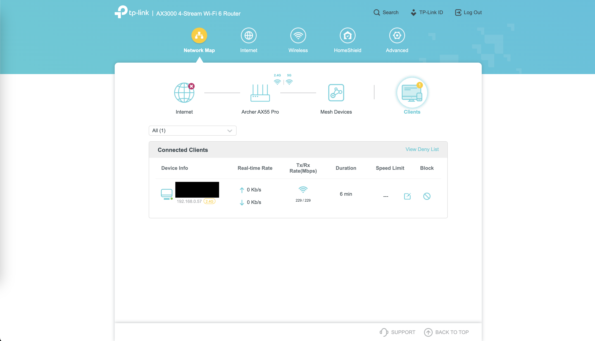

# Setting up the Router
## Table of Contents
- [What's in the Box](#whats-in-the-box)
- [What You Need](#what-you-need)
- [Powering On](#powering-on)
- [Connecting to the 2.4GHz Wireless Router Network](#connecting-to-the-24ghz-wireless-router-network)

## What's in the Box
The router used for this project is the [TP-Link Archer AX55 Pro](https://www.tp-link.com/au/home-networking/wifi-router/archer-ax55-pro/).

In the box, there should be (see below image):
- 1x Router.
- 1x Power Adapter.
- 1x Ethernet Cable.
- 1x Quick Installation Guide.

## What You Need
For the router setup, you need to have the following items:
- 1x Device (e.g. Laptop) with the ability to connect to a wireless network.
- 1x Power Adapter (comes in the box). Model: T120150-2E1.
- 1x Router (comes in the box). Model: Archer AX55 Pro(EU) Ver: 1.0.

## Powering On
1. Extend all of the antennae on the router.
2. Plug power adapter into the router, and turn on the power.
3. Press the power button.
    - The power light on the router should now turn green.
    
4. Wait a couple of minutes (during which time, the power light will start blinking slowly), then 2.4GHz and 5GHz wireless networks should start up.
    - The 2.4GHz and 5GHz lights on the router should now turn green.
    

## Connecting to the 2.4GHz Wireless Router Network
The names of the 2.4GHz and 5GHz wireless networks from the router should have identical names, except that the 5GHz has "_5G" added to the end of it. These names should be stated on the sticker on the back of the router.

Find the wireless network you wish to use in your device's list of available networks, and type in the password which will be specified on the back of the router, next to where the names of the networks were located.

> [!TIP]
> The 5GHz network will allow for faster data transmission, however the 2.4GHz network will have a better range.

You can verify your connection by opening a new browser tab, and entering "198.162.0.1" into the url field. This should load a page similar to the following image.

Go through the router setup steps, connecting it to the internet if you desire. If you do not wish to connect to the internet, you can click the "Exit Setup" button.

>[!TIP]
> If security is not required, use the password of the router network with an exclamation mark added to the end (e.g. if the network password is `12345678`, make the admin password `12345678!`).

You can see which devices are connected to the router network by clicking the "Clients" tab in the main dashboard, as shown in the below image.

